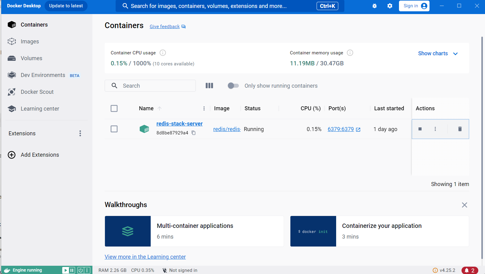

# Система регистрации и обработки пользовательских заявок

## Описание
Данное приложение предоставляет систему для регистрации пользователей, подачи заявок на рассмотрение оператором, а также управления правами доступа администратором.

## Функции

### Общие
- **Аутентификация и выдача JWT**: Пользователи могут логиниться в систему, получая JWT токены.
- **Выход из системы**: Пользователи могут выходить из системы через endpoint `/logout`.

### Пользователи
- **Создание заявок**: Пользователи могут создавать новые заявки и сохранять их как черновики.
- **Отправка заявок на рассмотрение**: Пользователи могут отправлять заявки на рассмотрение оператору.
- **Просмотр своих заявок**: Пользователи могут просматривать свои заявки с фильтрацией по статусу и сортировкой по дате.

### Операторы
- **Просмотр заявок**: Операторы могут просматривать все заявки, отправленные на рассмотрение, с возможностью фильтрации по имени пользователя.
- **Принятие и отклонение заявок**: Операторы могут принимать или отклонять заявки.

### Администраторы
- **Просмотр списка пользователей**: Администраторы могут просматривать список всех пользователей.
- **Назначение прав**: Администраторы могут назначать или изменять права пользователей.

**Допускается наличие нескольких ролей у пользователя.**

## Стэк используемых технологий
- **Java**: 17
- **Spring Boot**: для создания RESTful сервиса
- **Spring Security**: для аутентификации и авторизации
- **JPA**: для взаимодействия с реляционной базой данных
- **Базы данных**: PostgreSQL для хранения данных и Redis для хранения информации о токенах
- **Liquibase**: для миграций базы данных
- **Встроенный сервер приложений**: Apache Tomcat

## Swagger UI

Для ознакомления с документацией API и тестирования эндпоинтов используйте Swagger UI. Доступ к документации возможен по следующей ссылке:

[Swagger UI](http://localhost:8080/swagger-ui/index.html)

Для взаимодействия с защищенными эндпоинтами необходимо авторизоваться и получить токен. Используйте контроллер аутентификации пользователя для получения токена.

## Авторизационные данные

Для доступа к различным уровням системы используйте следующие,заранее добавленные, учетные данные:

- **Пользователь**
    - **Логин**: `John Doe`
    - **Пароль**: `user`

- **Оператор**
    - **Логин**: `Peter Parker`
    - **Пароль**: `operator`

- **Администратор**
    - **Логин**: `Bruce Wayne`
    - **Пароль**: `administrator`

## Redis
Используется Redis в Docker для кэширования и управления токенами:

## Конфигурационные параметры
Файл настроек `application.properties` содержит основные настройки приложения.
